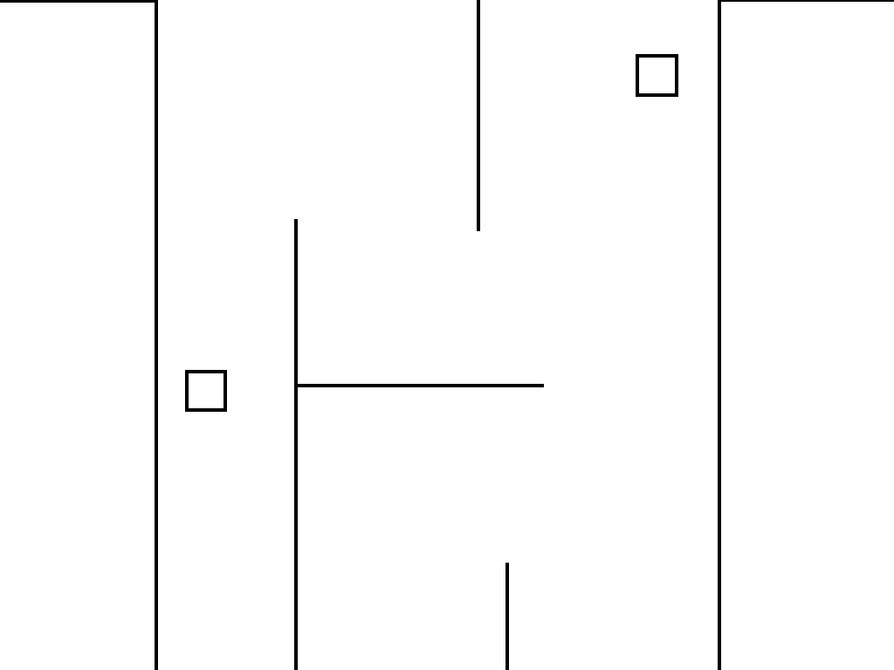

# Class 14

#### Topics: 
- If - else (control flow operations)
- add transition to make smooth movements
- Activate animations using buttons
- Encampsulation

### Homework
- Highlight
- Maze: 
   * extends class 13's homework so there are 2 squares that can move within a maze.
   * If the squares collide, they should be in red during collision only.
   * There most be 2 control sections so two players can play.
   
See mock up attached below (use your imagination)

