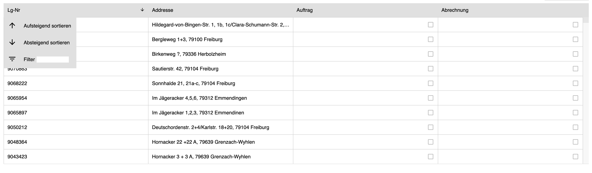

# Class 5

#### Topics: 
- animations
- overflow
- text-overflow
- calc function
- white-space and word-break

Homework:
 - Do a scrollable table that shows only 5 rows. 
 The table has to have a menu that will appear every time the user hover the header.
 If the text in a cell is too long, the text must be cut and a tool tip must be shown.
 
 
 
 - Build geometric shapes from 3 to 7 edges with only triangles. E.G
 
 
 
 

 